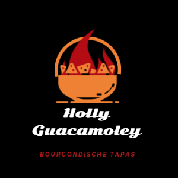

# Holly Guacamole

Een restaurant project ontwikkeld door Kay Geelen, Jasper Kusters en Rohan Kanhaisingh.

- - - 

## Waar het project over gaat

Dit project gaat over een restaurant dat een volledig werkend digitale menu systeem heeft. Het zou een directe verbinding 
creeëren tussen de klanten en het personeel.

Zo zou je bijvoorbeeld gerechten kunnen bestellen, en dat het personeel bij de kassa, in de keuken, bij de administratie of 
alle overige personeelsleden dit zouden kunnen handelen. 

## Hoe dit project te werk gaat

Wij maken gebruik van de programmeertalen PHP, JavaScript, MySQL, HTML, CSS en overige talen om dit project samen te stellen.
De broncode staat open, zodat iedereen (die toegang heeft tot dit project) gebruik hiervan kunt maken. Het is dus een samengestelde
webapplicatie.

Deze applicatie kun je gebruiken doormiddel van een moderne webbrowser, zoals Google Chrome, Microsoft Edge, Mozilla Firefox 
en alle andere browsers die de huidige technologiën ondersteunen.

De applicatie moet wel verbinding maken met een server, waar een database op staat. Wij hebben al een server opgezet
met een compleet gevulde database die lokaal gehost is op een Raspberry PI.

## Waarom dit project

Wij willen laten zien dat wij klaar zijn om de derde jaar in te gaan, en dat kunnen wij doen met dit project.

Hierin laten we zien hoe ver we zijn met onze programmeer, design en structuur vaardigheden.

